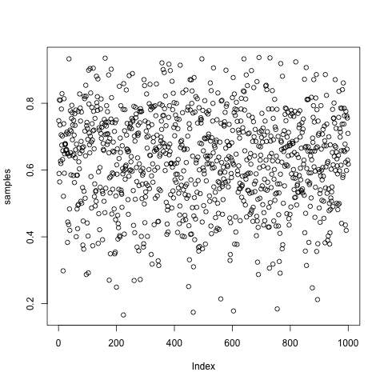
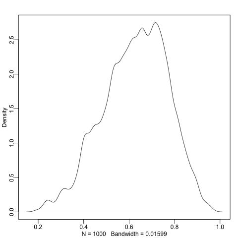

# Grid Approximation of Globe Tossing

The probability that we got $k$ Waters given that $p$ is proportion of water to land can be expressed as a Binonial distribution.

$$
\begin{equation}
Pr(X=k|p) \sim \binom{N}{k}p^k(1-p)^{N-k}
\end{equation}
$$

Using Baye's theorem, we know the probability that $p$ is the proportion of water on earth given the we got $k$ waters in $N$ tosses is 

$$
\begin{equation}
Posterior = Pr(p|X) = \frac{P(X|p) \cdot Pr(p)}{Pr(X)}
\end{equation}
$$

Where $Pr(X)$ is the *average probability of the data* or the *average likelihood* or the [marginal likelihood](https://www.sciencedirect.com/topics/computer-science/marginal-likelihood)

$$
\begin{equation}
Pr(X) = E[Pr(X|p)] = \int Pr(X|p) Pr(p)dp
\end{equation}
$$


Now we can generate 1000 samples from our posterior distribution. Each
sample is a proportion of water, because of how we constructed the
posterior, there will be more proportions around 0.7 and fewer extreme
proportions. We can plot the density of the samples to get an idea of the shape of 
our distribution

 


And we can start to make predictions 

```R

# about 19% of the samples be < 0.5
sum(samples < 0.5) / sample_size
# [1] 0.192

# most of the samples will fall in this range, since that's how we defined the posterior distribution
sum(samples > 0.5 & samples < 0.75) / sample_size
# [1] 0.602

# with 95% confidence, the true p is within this range
quantile(samples, c(0.05, 0.95))
#        5%       95% 
# 0.3893894 0.8428428 
```
